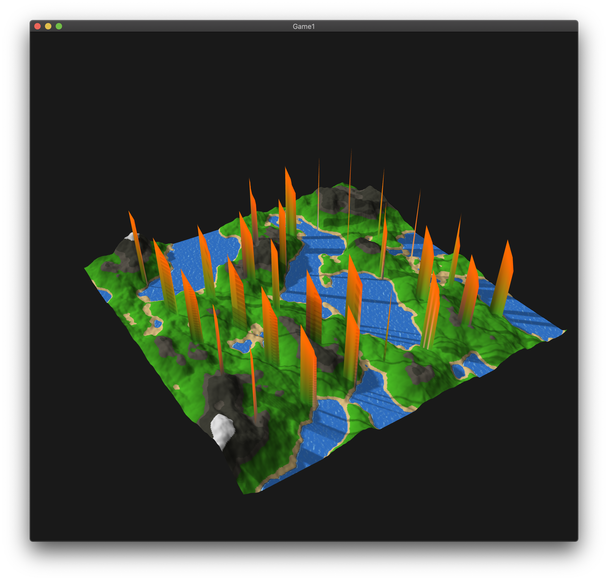
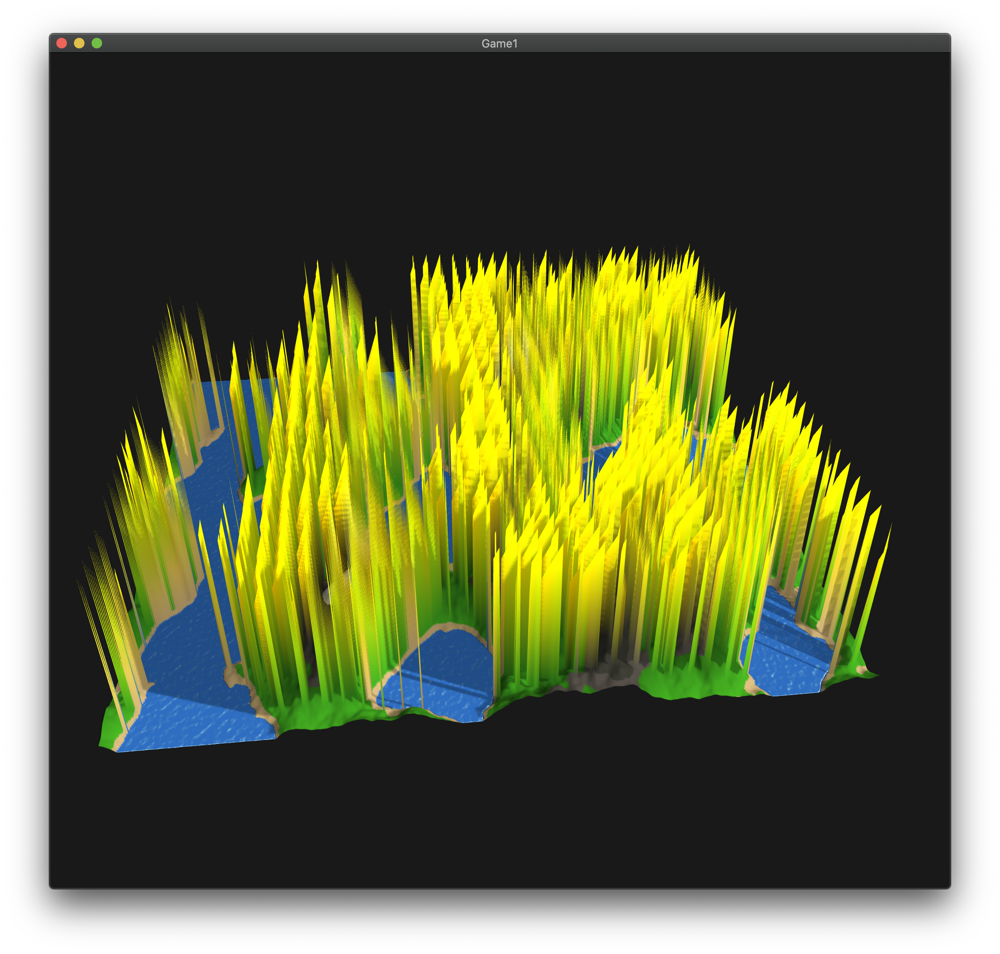
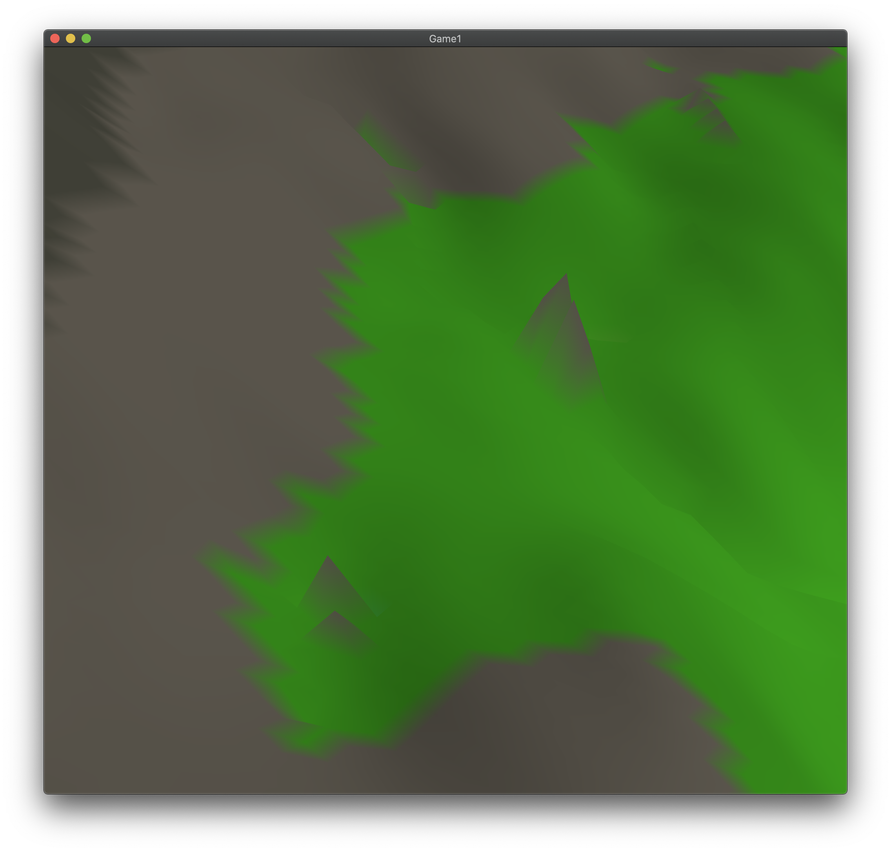
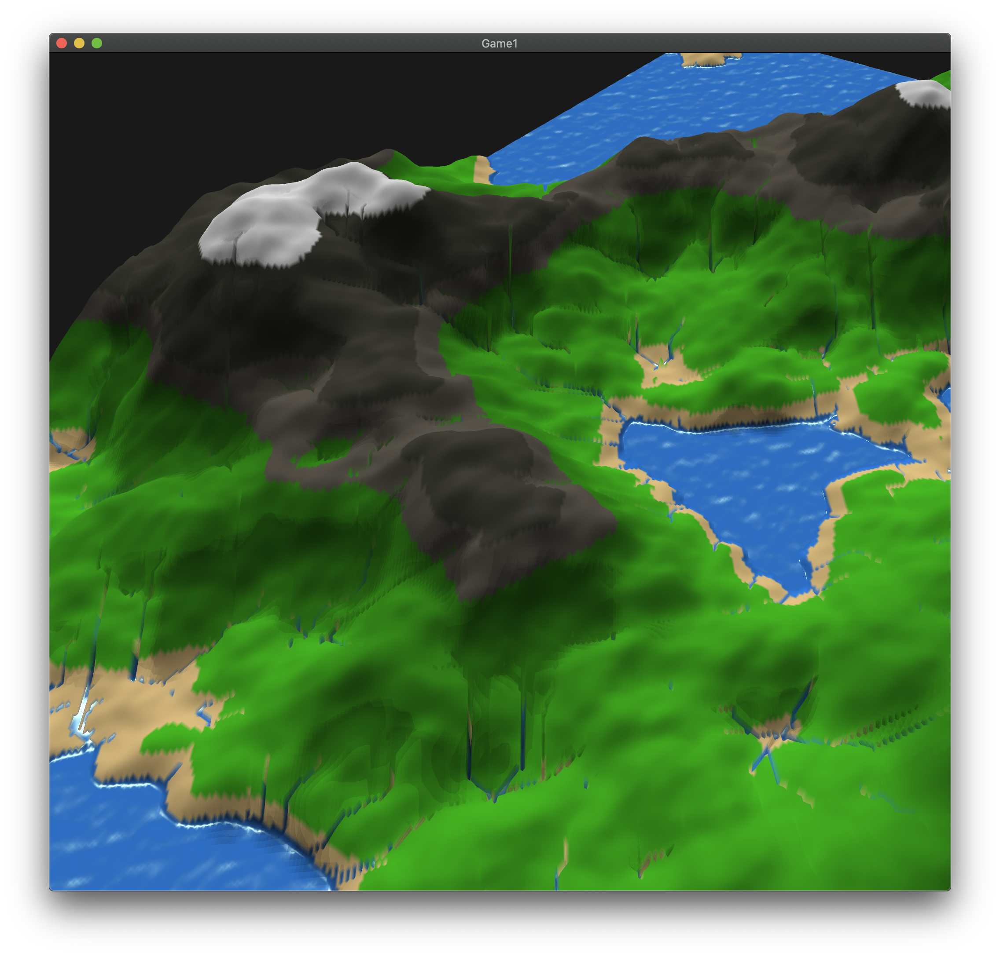

# Terrain-generation
OpenGL terrain generation and hydraulic erosion simulation using OpenGL 3.3.

This was my first major graphics project with OpenGL. It began with generating a terrain mesh using my own custom Perlin noise implementation, and progressed to feature Phong lighting, animated water, and shadows. I'm currently attempting to achieve hydraulic erosion simulation on the generated terrain. Below are progress photos.

There was a lot of experimentation getting the function right for the water animation. This had to be handled in the vertex shader.

The water began to improve with fine tuned specular lighting and better coloring.

This water satisfied me so I moved on to erosion simulation.

Erosion simulation began with checking to make sure the gradient was calculated properly. I did this with visualizations shown below.

I then began attempting to simulate water droplets rolling down the terrain with momentum and a sedimentation coefficient. These droplets pick up sedimentation the faster they roll and deposit it when they slow down.

This image shows early signs the sedimentation was starting to work, although enevenly.

This image shows the beginnings of successful hydraulic erosion.

