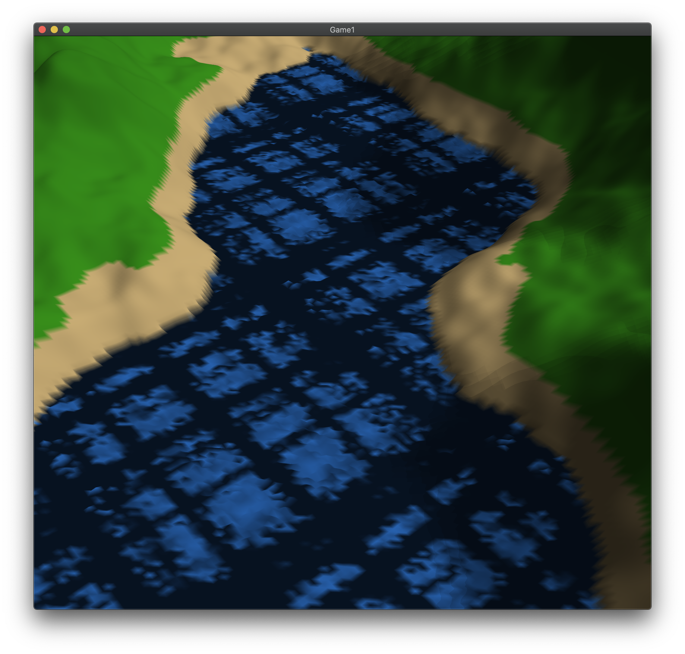
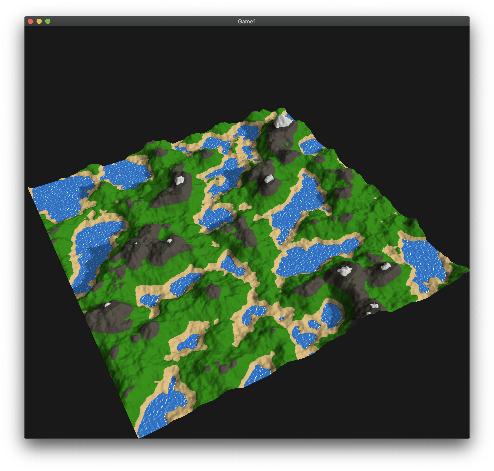
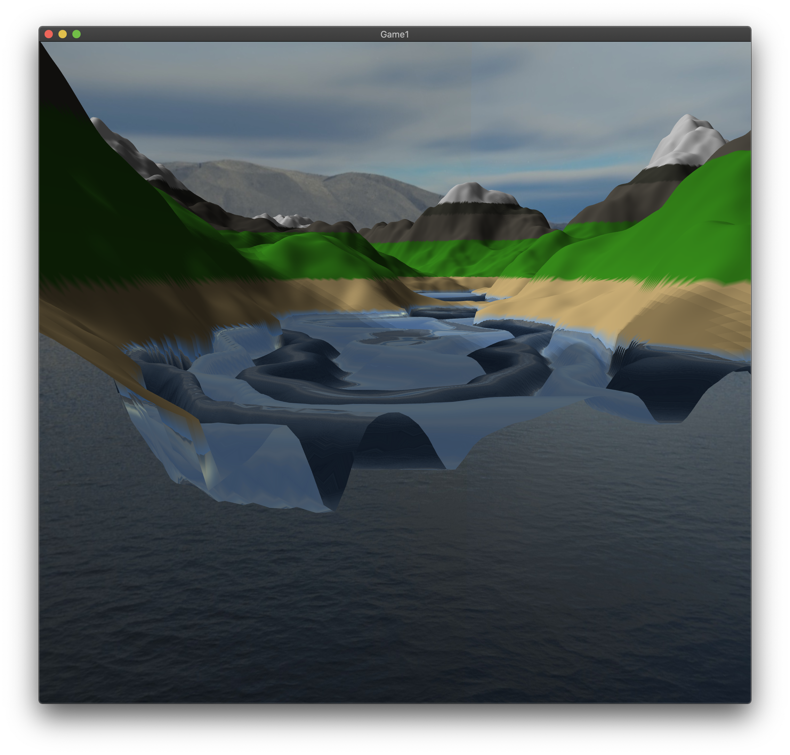
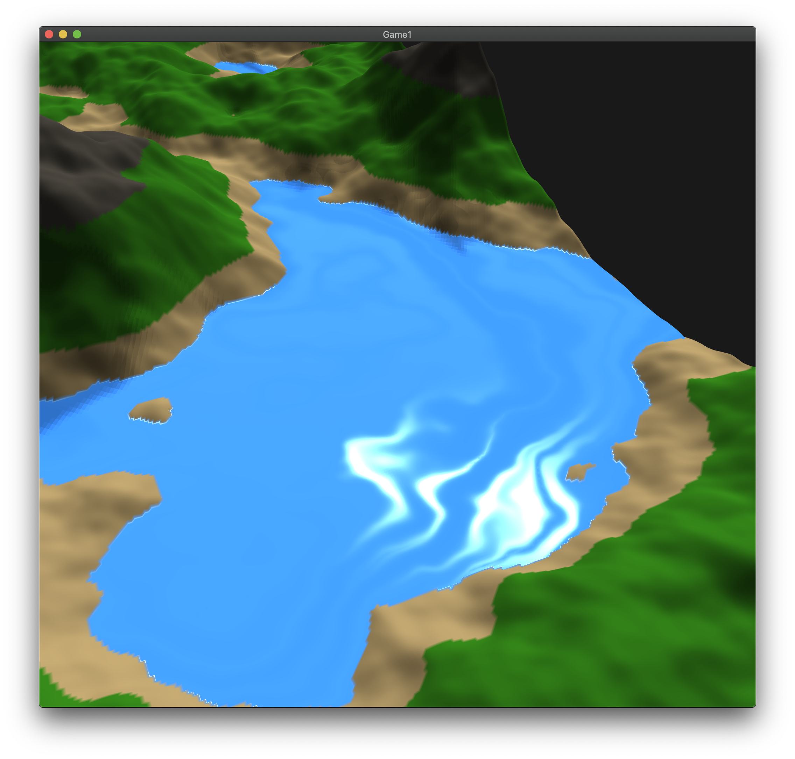
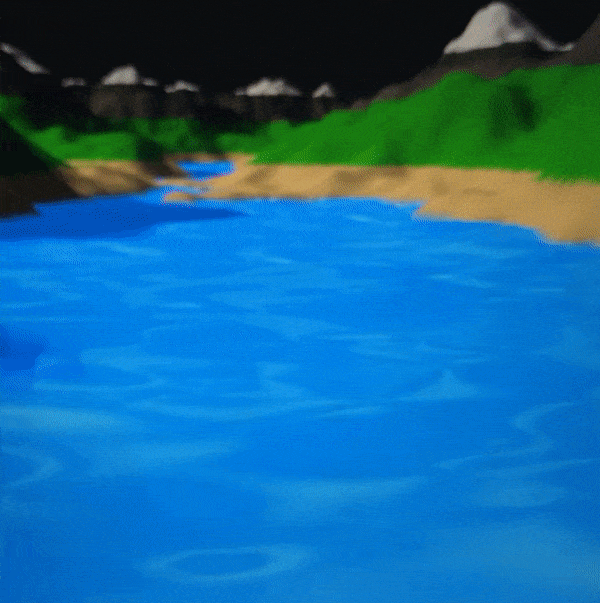
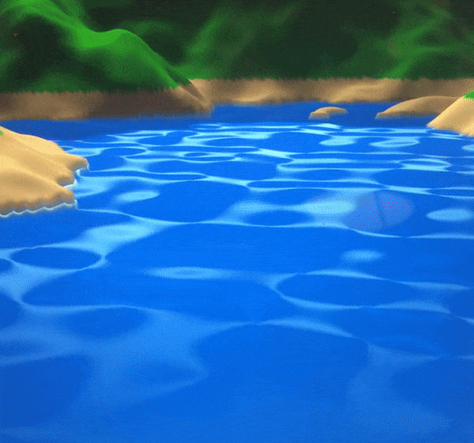
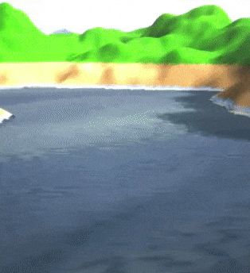

# Terrain-generation
OpenGL terrain generation and hydraulic erosion simulation using OpenGL 3.3.

This was my first major graphics project with OpenGL. It began with generating a terrain mesh using my own custom Perlin noise implementation, and progressed to feature Phong lighting, animated water, and shadows. I'm currently attempting to achieve hydraulic erosion simulation on the generated terrain. Below are progress photos.

There was a lot of experimentation getting the function right for the water animation. This had to be handled in the vertex shader.

The water began to improve with fine tuned specular lighting and better coloring.

This water satisfied me so I moved on to erosion simulation.

